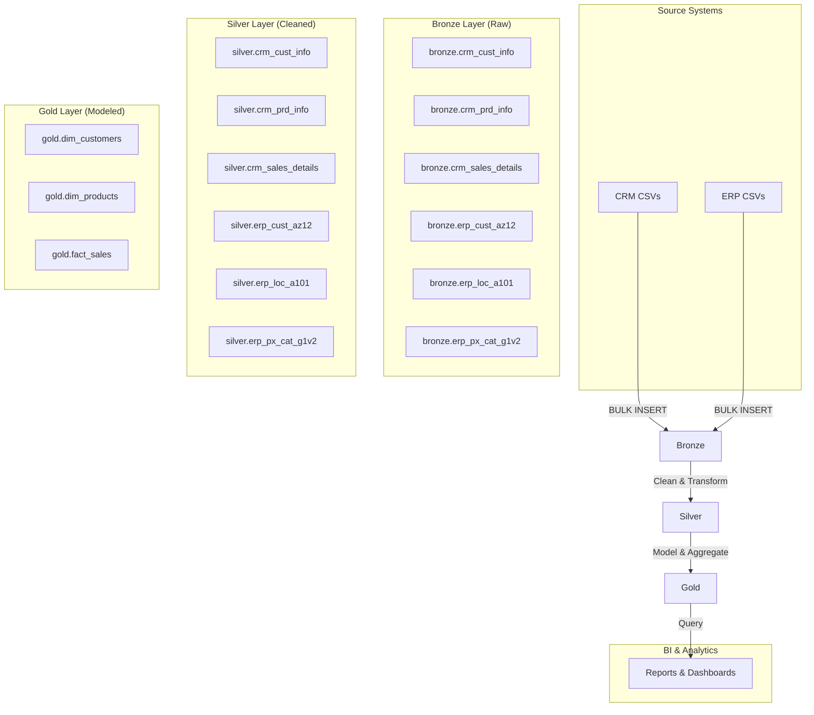
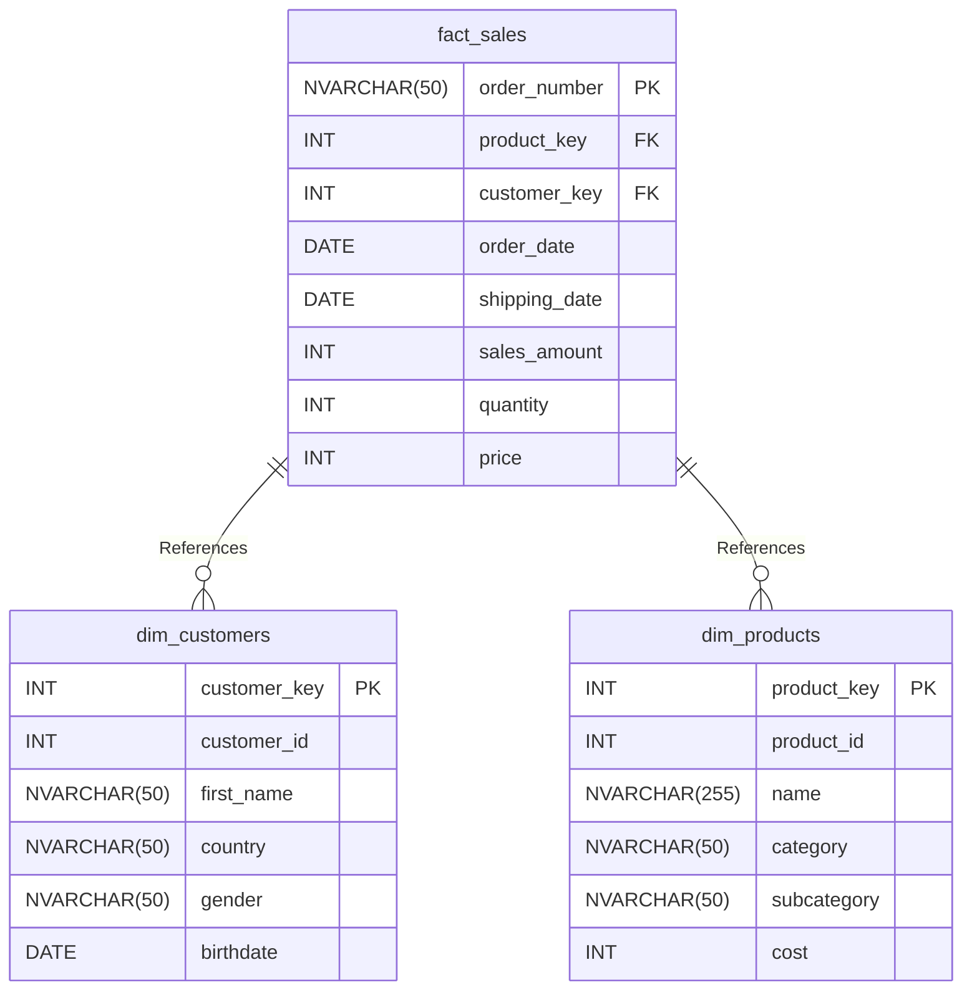

# E-commerce Sales Data Warehouse on SQL Server

This project implements a complete data warehouse for an e-commerce store specializing in bikes, clothing, and accessories. It follows the **Medallion Architecture** (Bronze, Silver, Gold) using T-SQL on SQL Server to process data from CRM and ERP system exports.

-   **Bronze Layer**: Ingests raw, unaltered data from source CSV files.
-   **Silver Layer**: Cleans, standardizes, and enriches the data, preparing it for analytics.
-   **Gold Layer**: Creates business-ready, dimensional models (facts and dimensions) as views for reporting and analysis.

## Architecture Overview

The data flows through three distinct layers, each serving a specific purpose in the ETL (Extract, Transform, Load) process.


## Prerequisites

-   SQL Server (2017 or later).
-   SQL Server Management Studio (SSMS) or a compatible SQL client.
-   Permissions to create databases, schemas, tables, and execute stored procedures.
-   Source CSV files located in a directory accessible by the SQL Server instance for the `BULK INSERT` operation.

## Project Structure
├── README.md
├── datasets/
│ ├── source_crm/
│ │ ├── cust_info.csv
│ │ ├── prd_info.csv
│ │ └── sales_details.csv
│ └── source_erp/
│ ├── cust_az12.csv
│ ├── loc_a101.csv
│ └── px_cat_g1v2.csv
└── sql_scripts/
├── 1_create_database.sql
├── 2_create_bronze_tables.sql
├── 3_load_bronze.sql
├── 4_create_silver_tables.sql
├── 5_load_silver.sql
└── 6_create_gold_views.sql

## How to Run the ETL Pipeline

Execute the following SQL scripts in order.

### 1. Create Database and Schemas

This script sets up the `DataWarehouse` database and the `bronze`, `silver`, and `gold` schemas.
**Warning**: This will drop the `DataWarehouse` database if it already exists.

```sql
-- File: 1_create_database.sql
USE master;
GO

IF EXISTS (SELECT 1 FROM sys.databases WHERE name = 'DataWarehouse')
BEGIN
	ALTER DATABASE DataWarehouse SET SINGLE_USER WITH ROLLBACK IMMEDIATE;
	DROP DATABASE DataWarehouse;
END;
GO

CREATE DATABASE DataWarehouse;
GO

USE DataWarehouse;
GO

CREATE SCHEMA bronze;
GO
CREATE SCHEMA silver;
GO
CREATE SCHEMA gold;
GO
```
### 2. Create Bronze Layer Tables

This script defines the table structures in the `bronze` schema to hold the raw data exactly as it appears in the source files.

```sql
-- File: 2_create_bronze_tables.sql
USE DataWarehouse;
GO

-- CRM Tables
IF OBJECT_ID ('bronze.crm_cust_info', 'u') IS NOT NULL DROP TABLE bronze.crm_cust_info;
CREATE TABLE bronze.crm_cust_info (cst_id INT, cst_key NVARCHAR(50), cst_firstname NVARCHAR(50), cst_lastname NVARCHAR(50), cst_marital_status NVARCHAR(50), cst_gndr NVARCHAR(50), cst_create_date DATE);

IF OBJECT_ID ('bronze.crm_prd_info', 'u') IS NOT NULL DROP TABLE bronze.crm_prd_info;
CREATE TABLE bronze.crm_prd_info(prd_id INT, prd_key NVARCHAR(50), prd_nm NVARCHAR(50), prd_cost INT, prd_line NVARCHAR(50), prd_start_dt DATETIME, prd_end_dt DATETIME);

IF OBJECT_ID ('bronze.crm_sales_details', 'u') IS NOT NULL DROP TABLE bronze.crm_sales_details;
CREATE TABLE bronze.crm_sales_details(sls_ord_num NVARCHAR(50), sls_prd_key NVARCHAR(50), sls_cust_id INT, sls_order_dt INT, sls_ship_dt INT, sls_due_dt INT, sls_sales INT, sls_quantity INT, sls_price INT);

-- ERP Tables
IF OBJECT_ID ('bronze.erp_cust_az12', 'u') IS NOT NULL DROP TABLE bronze.erp_cust_az12;
CREATE TABLE bronze.erp_cust_az12(cid NVARCHAR(50), bdate DATE, gen NVARCHAR(50));

IF OBJECT_ID ('bronze.erp_loc_a101', 'u') IS NOT NULL DROP TABLE bronze.erp_loc_a101;
CREATE TABLE bronze.erp_loc_a101(cid NVARCHAR(50), cntry NVARCHAR(50));

IF OBJECT_ID ('bronze.erp_px_cat_g1v2', 'u') IS NOT NULL DROP TABLE bronze.erp_px_cat_g1v2;
CREATE TABLE bronze.erp_px_cat_g1v2(id NVARCHAR(50), cat NVARCHAR(50), subcat NVARCHAR(50), maintenance NVARCHAR(50));
```

### 3. Load Data into Bronze Layer

This stored procedure, `bronze.load_bronze`, truncates the bronze tables and uses `BULK INSERT` to load data from the source CSV files.

**Note:** You must update the `FROM` path in the script to match the location of your dataset files.

```sql
-- File: 3_load_bronze.sql
USE DataWarehouse;
GO
CREATE OR ALTER PROCEDURE bronze.load_bronze AS
BEGIN
    BEGIN TRY
        TRUNCATE TABLE bronze.crm_cust_info;
        BULK INSERT bronze.crm_cust_info
        FROM 'C:\path\to\your\datasets\source_crm\cust_info.csv'
        WITH (FIRSTROW = 2, FIELDTERMINATOR = ',', TABLOCK);

        TRUNCATE TABLE bronze.crm_prd_info;
        BULK INSERT bronze.crm_prd_info
        FROM 'C:\path\to\your\datasets\source_crm\prd_info.csv'
        WITH (FIRSTROW = 2, FIELDTERMINATOR = ',', TABLOCK);

        TRUNCATE TABLE bronze.crm_sales_details;
        BULK INSERT bronze.crm_sales_details
        FROM 'C:\path\to\your\datasets\source_crm\sales_details.csv'
        WITH (FIRSTROW = 2, FIELDTERMINATOR = ',', TABLOCK);

        TRUNCATE TABLE bronze.erp_cust_az12;
        BULK INSERT bronze.erp_cust_az12
        FROM 'C:\path\to\your\datasets\source_erp\cust_az12.csv'
        WITH (FIRSTROW = 2, FIELDTERMINATOR = ',', TABLOCK);

        TRUNCATE TABLE bronze.erp_loc_a101;
        BULK INSERT bronze.erp_loc_a101
        FROM 'C:\path\to\your\datasets\source_erp\loc_a101.csv'
        WITH (FIRSTROW = 2, FIELDTERMINATOR = ',', TABLOCK);

        TRUNCATE TABLE bronze.erp_px_cat_g1v2;
        BULK INSERT bronze.erp_px_cat_g1v2
        FROM 'C:\path\to\your\datasets\source_erp\px_cat_g1v2.csv'
        WITH (FIRSTROW = 2, FIELDTERMINATOR = ',', TABLOCK);
    END TRY
    BEGIN CATCH
        PRINT 'Error: ' + ERROR_MESSAGE();
    END CATCH
END
GO

-- Execute the procedure to load data
-- EXEC bronze.load_bronze;
```
### 4. Create Silver Layer Tables

This script defines the tables in the `silver` schema, which will hold the cleaned and transformed data. Data types are corrected, and columns for metadata (like `dwh_create_date`) are added.

```sql
-- File: 4_create_silver_tables.sql
USE DataWarehouse;
GO

-- CRM Tables
IF OBJECT_ID ('silver.crm_cust_info', 'u') IS NOT NULL DROP TABLE silver.crm_cust_info;
CREATE TABLE silver.crm_cust_info (cst_id INT, cst_key NVARCHAR(50), cst_firstname NVARCHAR(50), cst_lastname NVARCHAR(50), cst_marital_status NVARCHAR(50), cst_gndr NVARCHAR(50), cst_create_date DATE, dwh_create_date DATETIME DEFAULT GETDATE());

IF OBJECT_ID ('silver.crm_prd_info', 'u') IS NOT NULL DROP TABLE silver.crm_prd_info;
CREATE TABLE silver.crm_prd_info(prd_id INT, cat_id NVARCHAR(50), prd_key NVARCHAR(50), prd_nm NVARCHAR(50), prd_cost INT, prd_line NVARCHAR(50), prd_start_dt DATE, prd_end_dt DATE, dwh_create_date DATETIME DEFAULT GETDATE());

IF OBJECT_ID ('silver.crm_sales_details', 'u') IS NOT NULL DROP TABLE silver.crm_sales_details;
CREATE TABLE silver.crm_sales_details(sls_ord_num NVARCHAR(50), sls_prd_key NVARCHAR(50), sls_cust_id INT, sls_order_dt DATE, sls_ship_dt DATE, sls_due_dt DATE, sls_sales INT, sls_quantity INT, sls_price INT, dwh_create_date DATETIME DEFAULT GETDATE());

-- ERP Tables
IF OBJECT_ID ('silver.erp_cust_az12', 'u') IS NOT NULL DROP TABLE silver.erp_cust_az12;
CREATE TABLE silver.erp_cust_az12(cid NVARCHAR(50), bdate DATE, gen NVARCHAR(50), dwh_create_date DATETIME DEFAULT GETDATE());

IF OBJECT_ID ('silver.erp_loc_a101', 'u') IS NOT NULL DROP TABLE silver.erp_loc_a101;
CREATE TABLE silver.erp_loc_a101(cid NVARCHAR(50), cntry NVARCHAR(50), dwh_create_date DATETIME DEFAULT GETDATE());

IF OBJECT_ID ('silver.erp_px_cat_g1v2', 'u') IS NOT NULL DROP TABLE silver.erp_px_cat_g1v2;
CREATE TABLE silver.erp_px_cat_g1v2(id NVARCHAR(50), cat NVARCHAR(50), subcat NVARCHAR(50), maintenance NVARCHAR(50), dwh_create_date DATETIME DEFAULT GETDATE());
```
### 5. Load Data into Silver Layer

The `silver.load_silver` procedure reads data from the `bronze` tables, applies cleaning logic (e.g., `TRIM`, `CASE` statements, handling `NULL`s, standardizing values), and inserts the result into the `silver` tables.

```sql
-- File: 5_load_silver.sql
USE DataWarehouse;
GO
CREATE OR ALTER PROCEDURE silver.load_silver AS
BEGIN
    BEGIN TRY
        -- Clean and load crm_cust_info
        TRUNCATE TABLE silver.crm_cust_info;
        INSERT INTO silver.crm_cust_info ([cst_id], [cst_key], [cst_firstname], [cst_lastname], [cst_marital_status], [cst_gndr], [cst_create_date])
        SELECT [cst_id], [cst_key], TRIM([cst_firstname]), TRIM([cst_lastname]),
               CASE WHEN TRIM(UPPER([cst_marital_status])) = 'S' THEN 'Single' WHEN TRIM(UPPER([cst_marital_status])) = 'M' THEN 'Married' ELSE 'N/A' END,
               CASE WHEN TRIM(UPPER([cst_gndr])) = 'M' THEN 'Male' WHEN TRIM(UPPER([cst_gndr])) = 'F' THEN 'Female' ELSE 'N/A' END,
               [cst_create_date]
        FROM (SELECT *, ROW_NUMBER() OVER (PARTITION BY cst_id ORDER BY cst_create_date DESC) AS flag_last FROM [DataWarehouse].[bronze].[crm_cust_info] WHERE cst_id IS NOT NULL) t
        WHERE flag_last = 1;

        -- Clean and load crm_prd_info
        TRUNCATE TABLE silver.crm_prd_info;
        INSERT INTO silver.crm_prd_info ([prd_id], [cat_id], [prd_key], [prd_nm], [prd_cost], [prd_line], [prd_start_dt], [prd_end_dt])
        SELECT [prd_id], REPLACE(SUBSTRING(prd_key, 1, 5), '-', '_'), REPLACE(SUBSTRING(prd_key, 7, LEN(prd_key)-6), '_', '-'), [prd_nm], ISNULL([prd_cost], 0),
               CASE TRIM(UPPER([prd_line])) WHEN 'M' THEN 'Mountain' WHEN 'R' THEN 'Road' WHEN 'S' THEN 'Other Sales' WHEN 'T' THEN 'Touring' ELSE 'n/a' END,
               CAST([prd_start_dt] AS DATE), CAST(LEAD([prd_start_dt]) OVER (PARTITION BY [prd_key] ORDER BY [prd_start_dt] - 1 ASC) AS DATE)
        FROM bronze.crm_prd_info;

        -- Clean and load crm_sales_details
        TRUNCATE TABLE silver.crm_sales_details;
        INSERT INTO silver.crm_sales_details ([sls_ord_num], [sls_prd_key], [sls_cust_id], [sls_order_dt], [sls_ship_dt], [sls_due_dt], [sls_sales], [sls_quantity], [sls_price])
        SELECT [sls_ord_num], [sls_prd_key], [sls_cust_id],
               CASE WHEN [sls_order_dt] <= 0 OR LEN(NULLIF([sls_order_dt], 0)) != 8 THEN NULL ELSE CAST(CAST([sls_order_dt] AS NVARCHAR(50)) AS DATE) END,
               CASE WHEN [sls_ship_dt] <= 0 OR LEN(NULLIF([sls_ship_dt], 0)) != 8 THEN NULL ELSE CAST(CAST([sls_ship_dt] AS NVARCHAR(50)) AS DATE) END,
               CASE WHEN [sls_due_dt] <= 0 OR LEN(NULLIF([sls_due_dt], 0)) != 8 THEN NULL ELSE CAST(CAST([sls_due_dt] AS NVARCHAR(50)) AS DATE) END,
               CASE WHEN [sls_sales] IS NULL OR [sls_sales] <= 0 OR ABS([sls_price]) * ABS([sls_quantity]) != [sls_sales] AND [sls_price] IS NOT NULL AND [sls_quantity] IS NOT NULL THEN ABS([sls_quantity]) * ABS([sls_price]) ELSE ABS([sls_sales]) END,
               [sls_quantity],
               CASE WHEN [sls_price] IS NULL OR [sls_price] <= 0 AND ABS([sls_sales]) IS NOT NULL AND ABS([sls_quantity]) IS NOT NULL THEN [sls_sales]/NULLIF([sls_quantity],0) ELSE ABS([sls_price]) END
        FROM bronze.crm_sales_details;

        -- Clean and load erp_cust_az12
        TRUNCATE TABLE silver.erp_cust_az12;
        INSERT INTO silver.erp_cust_az12 ([cid], [bdate], [gen])
        SELECT CASE WHEN LEN([cid]) = 13 THEN SUBSTRING([cid], 4, LEN([cid])) ELSE [cid] END,
               CASE WHEN [bdate] > GETDATE() THEN NULL ELSE [bdate] END,
               CASE WHEN TRIM(UPPER([gen])) IN ('F', 'FEMALE') THEN 'Female' WHEN TRIM(UPPER([gen])) IN ('M', 'MALE') THEN 'Male' ELSE 'n/a' END
        FROM bronze.erp_cust_az12;

        -- Clean and load erp_loc_a101
        TRUNCATE TABLE silver.erp_loc_a101;
        INSERT INTO silver.erp_loc_a101 ([cid], [cntry])
        SELECT REPLACE([cid], '-', ''), ISNULL(CASE UPPER(TRIM([cntry])) WHEN 'DE' THEN 'Germany' WHEN 'USA' THEN 'United States' WHEN 'US' THEN 'United States' WHEN '' THEN 'n/a' ELSE [cntry] END, 'n/a')
        FROM bronze.erp_loc_a101;

        -- Clean and load erp_px_cat_g1v2
        TRUNCATE TABLE silver.erp_px_cat_g1v2;
        INSERT INTO silver.erp_px_cat_g1v2 ([id], [cat], [subcat], [maintenance])
        SELECT [id], TRIM([cat]), TRIM([subcat]), TRIM([maintenance]) FROM bronze.erp_px_cat_g1v2;

    END TRY
    BEGIN CATCH
        PRINT 'Error: ' + ERROR_MESSAGE();
    END CATCH
END
GO

-- Execute the procedure to transform data
-- EXEC silver.load_silver;
```

### 6. Create Gold Layer Views (Dimensional Model)

This final script builds the dimensional model on top of the `silver` data. It creates views for `dim_customers`, `dim_products`, and `fact_sales` to provide a user-friendly and analytics-optimized data structure.

```sql
-- File: 6_create_gold_views.sql
USE DataWarehouse;
GO

-- Dimension: Customers
CREATE OR ALTER VIEW gold.dim_customers AS
SELECT
    ROW_NUMBER() OVER (ORDER BY ci.cst_id) AS customer_key,
    ci.cst_id AS customer_id,
    ci.cst_key AS customer_number,
    ci.cst_firstname AS first_name,
    ci.cst_lastname AS last_name,
    la.cntry AS country,
    ci.cst_marital_status AS marital_status,
    CASE WHEN ci.cst_gndr != 'N/A' THEN ci.cst_gndr ELSE COALESCE(ca.gen, 'n/a') END AS gender,
    ca.bdate AS birthdate,
    ci.cst_create_date AS create_date
FROM silver.crm_cust_info AS ci
LEFT JOIN silver.erp_cust_az12 AS ca ON ci.cst_key = ca.cid
LEFT JOIN silver.erp_loc_a101 AS la ON ci.cst_key = la.cid;
GO

-- Dimension: Products
CREATE OR ALTER VIEW gold.dim_products AS
SELECT DISTINCT
    ROW_NUMBER() OVER(ORDER BY pi.prd_id) AS product_key,
    pi.prd_id AS product_id,
    pi.prd_key AS product_number,
    pi.prd_nm AS name,
    pi.cat_id AS category_id,
    ct.cat AS category,
    ct.subcat AS subcategory,
    ct.maintenance AS maintenance,
    pi.prd_cost AS cost,
    pi.prd_line AS product_line,
    pi.prd_start_dt AS start_date
FROM silver.crm_prd_info AS pi
LEFT JOIN silver.erp_px_cat_g1v2 AS ct ON pi.cat_id = ct.id
WHERE pi.prd_end_dt IS NULL; -- Business rule: only include active products
GO

-- Fact: Sales
CREATE OR ALTER VIEW gold.fact_sales AS
SELECT
    sd.sls_ord_num AS order_number,
    dp.product_key,
    dc.customer_key,
    sd.sls_order_dt AS order_date,
    sd.sls_ship_dt AS shipping_date,
    sd.sls_due_dt AS due_date,
    sd.sls_sales AS sales_amount,
    sd.sls_quantity AS quantity,
    sd.sls_price AS price
FROM silver.crm_sales_details AS sd
LEFT JOIN gold.dim_customers AS dc ON sd.sls_cust_id = dc.customer_id
LEFT JOIN gold.dim_products AS dp ON sd.sls_prd_key = dp.product_number;
GO
```
## Gold Layer: Data Catalog

### **1. fact_sales**

Records transactional sales data including order details, customer/product references, and financial metrics.

| Column Name | Data Type | Description | Example |
| :--- | :--- | :--- | :--- |
| `order_number` | NVARCHAR(50) | Unique sales order identifier | `SO43766` |
| `product_key` | INT | Foreign key to `dim_products` | `48` |
| `customer_key` | INT | Foreign key to `dim_customers` | `5519` |
| `order_date` | DATE | Date order was placed | `2011-01-15` |
| `shipping_date` | DATE | Date product was shipped | `2011-01-22` |
| `due_date` | DATE | Expected delivery date | `2011-01-27` |
| `sales_amount`| INT | Total revenue (quantity × price) | `3578` |
| `quantity` | INT | Units purchased | `1` |
| `price` | INT | Unit price | `3578` |

---

### **2. dim_customers**

Stores customer demographic and profile information.

| Column Name | Data Type | Description | Example |
| :--- | :--- | :--- | :--- |
| `customer_key` | INT | Unique surrogate key | `1` |
| `customer_id` | INT | Internal system ID | `11000` |
| `customer_number`| NVARCHAR(50)| Public-facing ID | `AW00011000` |
| `first_name` | NVARCHAR(50)| Customer's first name | `Jon` |
| `last_name` | NVARCHAR(50)| Customer's last name | `Yang` |
| `country` | NVARCHAR(50)| Country of residence | `Australia` |
| `marital_status`| NVARCHAR(50)| `Single` or `Married` | `Married` |
| `gender` | NVARCHAR(50)| `Male` or `Female` | `Male` |
| `birthdate` | DATE | Date of birth | `1971-10-06` |
| `create_date` | DATE | Record creation date | `2025-10-06` |

---

### **3. dim_products**

Contains product details including categorization, costs, and lifecycle.

| Column Name | Data Type | Description | Example |
| :--- | :--- | :--- | :--- |
| `product_key` | INT | Unique surrogate key | `1` |
| `product_id` | INT | Internal system ID | `210` |
| `product_number`| NVARCHAR(50)| SKU/product code | `FR-R928-58` |
| `name` | NVARCHAR(255)| Full product name | `HL Road Frame - Black - 58` |
| `category` | NVARCHAR(50)| High-level category | `Bikes`, `Clothing` |
| `subcategory` | NVARCHAR(50)| Detailed subcategory | `Road Bikes`, `Jerseys`|
| `product_line` | NVARCHAR(50)| Business line (`Road`, `Mountain`) | `Road` |
| `cost` | INT | Manufacturing cost | `1059` |
| `start_date` | DATE | Product launch date | `2003-07-01` |

## Entity-Relationship Diagram




