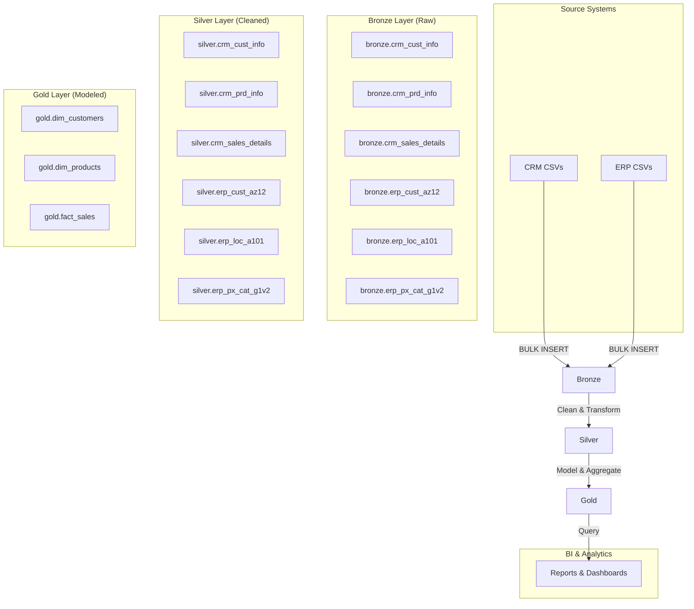

# E-commerce Sales Data Warehouse on SQL Server

This project implements a complete data warehouse and analysis for an e-commerce store specializing in bikes, clothing, and accessories. It follows the **Medallion Architecture** (Bronze, Silver, Gold) using T-SQL on SQL Server to process data from CRM and ERP system exports.

-   **Bronze Layer**: Ingests raw, unaltered data from source CSV files.
-   **Silver Layer**: Cleans, standardizes, and enriches the data, preparing it for analytics.
-   **Gold Layer**: Creates business-ready, dimensional models (facts and dimensions) as views for reporting and analysis.

## Architecture Overview

The data flows through three distinct layers, each serving a specific purpose in the ETL (Extract, Transform, Load) process.


## Prerequisites

-   SQL Server (2017 or later).
-   SQL Server Management Studio (SSMS) or a compatible SQL client.
-   Permissions to create databases, schemas, tables, and execute stored procedures.
-   Source CSV files located in a directory accessible by the SQL Server instance for the `BULK INSERT` operation.

## Project Structure
├── README.md
├── datasets/
│ ├── source_crm/
│ │ ├── cust_info.csv
│ │ ├── prd_info.csv
│ │ └── sales_details.csv
│ └── source_erp/
│ ├── cust_az12.csv
│ ├── loc_a101.csv
│ └── px_cat_g1v2.csv
└── sql_scripts/
├── 1_create_database.sql
├── 2_create_bronze_tables.sql
├── 3_load_bronze.sql
├── 4_create_silver_tables.sql
├── 5_load_silver.sql
└── 6_create_gold_views.sql

## How to Run the ETL Pipeline

Execute the following SQL scripts in order.

### 1. Create Database and Schemas

This script sets up the `DataWarehouse` database and the `bronze`, `silver`, and `gold` schemas.
**Warning**: This will drop the `DataWarehouse` database if it already exists.

```sql
-- File: 1_create_database.sql
USE master;
GO

IF EXISTS (SELECT 1 FROM sys.databases WHERE name = 'DataWarehouse')
BEGIN
	ALTER DATABASE DataWarehouse SET SINGLE_USER WITH ROLLBACK IMMEDIATE;
	DROP DATABASE DataWarehouse;
END;
GO

CREATE DATABASE DataWarehouse;
GO

USE DataWarehouse;
GO

CREATE SCHEMA bronze;
GO
CREATE SCHEMA silver;
GO
CREATE SCHEMA gold;
GO
```
### 2. Create Bronze Layer Tables

This script defines the table structures in the `bronze` schema to hold the raw data exactly as it appears in the source files.

```sql
-- File: 2_create_bronze_tables.sql
USE DataWarehouse;
GO

-- CRM Tables
IF OBJECT_ID ('bronze.crm_cust_info', 'u') IS NOT NULL DROP TABLE bronze.crm_cust_info;
CREATE TABLE bronze.crm_cust_info (cst_id INT, cst_key NVARCHAR(50), cst_firstname NVARCHAR(50), cst_lastname NVARCHAR(50), cst_marital_status NVARCHAR(50), cst_gndr NVARCHAR(50), cst_create_date DATE);

IF OBJECT_ID ('bronze.crm_prd_info', 'u') IS NOT NULL DROP TABLE bronze.crm_prd_info;
CREATE TABLE bronze.crm_prd_info(prd_id INT, prd_key NVARCHAR(50), prd_nm NVARCHAR(50), prd_cost INT, prd_line NVARCHAR(50), prd_start_dt DATETIME, prd_end_dt DATETIME);

IF OBJECT_ID ('bronze.crm_sales_details', 'u') IS NOT NULL DROP TABLE bronze.crm_sales_details;
CREATE TABLE bronze.crm_sales_details(sls_ord_num NVARCHAR(50), sls_prd_key NVARCHAR(50), sls_cust_id INT, sls_order_dt INT, sls_ship_dt INT, sls_due_dt INT, sls_sales INT, sls_quantity INT, sls_price INT);

-- ERP Tables
IF OBJECT_ID ('bronze.erp_cust_az12', 'u') IS NOT NULL DROP TABLE bronze.erp_cust_az12;
CREATE TABLE bronze.erp_cust_az12(cid NVARCHAR(50), bdate DATE, gen NVARCHAR(50));

IF OBJECT_ID ('bronze.erp_loc_a101', 'u') IS NOT NULL DROP TABLE bronze.erp_loc_a101;
CREATE TABLE bronze.erp_loc_a101(cid NVARCHAR(50), cntry NVARCHAR(50));

IF OBJECT_ID ('bronze.erp_px_cat_g1v2', 'u') IS NOT NULL DROP TABLE bronze.erp_px_cat_g1v2;
CREATE TABLE bronze.erp_px_cat_g1v2(id NVARCHAR(50), cat NVARCHAR(50), subcat NVARCHAR(50), maintenance NVARCHAR(50));
```

### 3. Load Data into Bronze Layer

This stored procedure, `bronze.load_bronze`, truncates the bronze tables and uses `BULK INSERT` to load data from the source CSV files.

**Note:** You must update the `FROM` path in the script to match the location of your dataset files.

```sql
-- File: 3_load_bronze.sql
USE DataWarehouse;
GO
CREATE OR ALTER PROCEDURE bronze.load_bronze AS
BEGIN
    BEGIN TRY
        TRUNCATE TABLE bronze.crm_cust_info;
        BULK INSERT bronze.crm_cust_info
        FROM 'C:\path\to\your\datasets\source_crm\cust_info.csv'
        WITH (FIRSTROW = 2, FIELDTERMINATOR = ',', TABLOCK);

        TRUNCATE TABLE bronze.crm_prd_info;
        BULK INSERT bronze.crm_prd_info
        FROM 'C:\path\to\your\datasets\source_crm\prd_info.csv'
        WITH (FIRSTROW = 2, FIELDTERMINATOR = ',', TABLOCK);

        TRUNCATE TABLE bronze.crm_sales_details;
        BULK INSERT bronze.crm_sales_details
        FROM 'C:\path\to\your\datasets\source_crm\sales_details.csv'
        WITH (FIRSTROW = 2, FIELDTERMINATOR = ',', TABLOCK);

        TRUNCATE TABLE bronze.erp_cust_az12;
        BULK INSERT bronze.erp_cust_az12
        FROM 'C:\path\to\your\datasets\source_erp\cust_az12.csv'
        WITH (FIRSTROW = 2, FIELDTERMINATOR = ',', TABLOCK);

        TRUNCATE TABLE bronze.erp_loc_a101;
        BULK INSERT bronze.erp_loc_a101
        FROM 'C:\path\to\your\datasets\source_erp\loc_a101.csv'
        WITH (FIRSTROW = 2, FIELDTERMINATOR = ',', TABLOCK);

        TRUNCATE TABLE bronze.erp_px_cat_g1v2;
        BULK INSERT bronze.erp_px_cat_g1v2
        FROM 'C:\path\to\your\datasets\source_erp\px_cat_g1v2.csv'
        WITH (FIRSTROW = 2, FIELDTERMINATOR = ',', TABLOCK);
    END TRY
    BEGIN CATCH
        PRINT 'Error: ' + ERROR_MESSAGE();
    END CATCH
END
GO

-- Execute the procedure to load data
-- EXEC bronze.load_bronze;
```
### 4. Create Silver Layer Tables

This script defines the tables in the `silver` schema, which will hold the cleaned and transformed data. Data types are corrected, and columns for metadata (like `dwh_create_date`) are added.

```sql
-- File: 4_create_silver_tables.sql
USE DataWarehouse;
GO

-- CRM Tables
IF OBJECT_ID ('silver.crm_cust_info', 'u') IS NOT NULL DROP TABLE silver.crm_cust_info;
CREATE TABLE silver.crm_cust_info (cst_id INT, cst_key NVARCHAR(50), cst_firstname NVARCHAR(50), cst_lastname NVARCHAR(50), cst_marital_status NVARCHAR(50), cst_gndr NVARCHAR(50), cst_create_date DATE, dwh_create_date DATETIME DEFAULT GETDATE());

IF OBJECT_ID ('silver.crm_prd_info', 'u') IS NOT NULL DROP TABLE silver.crm_prd_info;
CREATE TABLE silver.crm_prd_info(prd_id INT, cat_id NVARCHAR(50), prd_key NVARCHAR(50), prd_nm NVARCHAR(50), prd_cost INT, prd_line NVARCHAR(50), prd_start_dt DATE, prd_end_dt DATE, dwh_create_date DATETIME DEFAULT GETDATE());

IF OBJECT_ID ('silver.crm_sales_details', 'u') IS NOT NULL DROP TABLE silver.crm_sales_details;
CREATE TABLE silver.crm_sales_details(sls_ord_num NVARCHAR(50), sls_prd_key NVARCHAR(50), sls_cust_id INT, sls_order_dt DATE, sls_ship_dt DATE, sls_due_dt DATE, sls_sales INT, sls_quantity INT, sls_price INT, dwh_create_date DATETIME DEFAULT GETDATE());

-- ERP Tables
IF OBJECT_ID ('silver.erp_cust_az12', 'u') IS NOT NULL DROP TABLE silver.erp_cust_az12;
CREATE TABLE silver.erp_cust_az12(cid NVARCHAR(50), bdate DATE, gen NVARCHAR(50), dwh_create_date DATETIME DEFAULT GETDATE());

IF OBJECT_ID ('silver.erp_loc_a101', 'u') IS NOT NULL DROP TABLE silver.erp_loc_a101;
CREATE TABLE silver.erp_loc_a101(cid NVARCHAR(50), cntry NVARCHAR(50), dwh_create_date DATETIME DEFAULT GETDATE());

IF OBJECT_ID ('silver.erp_px_cat_g1v2', 'u') IS NOT NULL DROP TABLE silver.erp_px_cat_g1v2;
CREATE TABLE silver.erp_px_cat_g1v2(id NVARCHAR(50), cat NVARCHAR(50), subcat NVARCHAR(50), maintenance NVARCHAR(50), dwh_create_date DATETIME DEFAULT GETDATE());
```
### 5. Load Data into Silver Layer

The `silver.load_silver` procedure reads data from the `bronze` tables, applies cleaning logic (e.g., `TRIM`, `CASE` statements, handling `NULL`s, standardizing values), and inserts the result into the `silver` tables.

```sql
-- File: 5_load_silver.sql
USE DataWarehouse;
GO
CREATE OR ALTER PROCEDURE silver.load_silver AS
BEGIN
    BEGIN TRY
        -- Clean and load crm_cust_info
        TRUNCATE TABLE silver.crm_cust_info;
        INSERT INTO silver.crm_cust_info ([cst_id], [cst_key], [cst_firstname], [cst_lastname], [cst_marital_status], [cst_gndr], [cst_create_date])
        SELECT [cst_id], [cst_key], TRIM([cst_firstname]), TRIM([cst_lastname]),
               CASE WHEN TRIM(UPPER([cst_marital_status])) = 'S' THEN 'Single' WHEN TRIM(UPPER([cst_marital_status])) = 'M' THEN 'Married' ELSE 'N/A' END,
               CASE WHEN TRIM(UPPER([cst_gndr])) = 'M' THEN 'Male' WHEN TRIM(UPPER([cst_gndr])) = 'F' THEN 'Female' ELSE 'N/A' END,
               [cst_create_date]
        FROM (SELECT *, ROW_NUMBER() OVER (PARTITION BY cst_id ORDER BY cst_create_date DESC) AS flag_last FROM [DataWarehouse].[bronze].[crm_cust_info] WHERE cst_id IS NOT NULL) t
        WHERE flag_last = 1;

        -- Clean and load crm_prd_info
        TRUNCATE TABLE silver.crm_prd_info;
        INSERT INTO silver.crm_prd_info ([prd_id], [cat_id], [prd_key], [prd_nm], [prd_cost], [prd_line], [prd_start_dt], [prd_end_dt])
        SELECT [prd_id], REPLACE(SUBSTRING(prd_key, 1, 5), '-', '_'), REPLACE(SUBSTRING(prd_key, 7, LEN(prd_key)-6), '_', '-'), [prd_nm], ISNULL([prd_cost], 0),
               CASE TRIM(UPPER([prd_line])) WHEN 'M' THEN 'Mountain' WHEN 'R' THEN 'Road' WHEN 'S' THEN 'Other Sales' WHEN 'T' THEN 'Touring' ELSE 'n/a' END,
               CAST([prd_start_dt] AS DATE), CAST(LEAD([prd_start_dt]) OVER (PARTITION BY [prd_key] ORDER BY [prd_start_dt] - 1 ASC) AS DATE)
        FROM bronze.crm_prd_info;

        -- Clean and load crm_sales_details
        TRUNCATE TABLE silver.crm_sales_details;
        INSERT INTO silver.crm_sales_details ([sls_ord_num], [sls_prd_key], [sls_cust_id], [sls_order_dt], [sls_ship_dt], [sls_due_dt], [sls_sales], [sls_quantity], [sls_price])
        SELECT [sls_ord_num], [sls_prd_key], [sls_cust_id],
               CASE WHEN [sls_order_dt] <= 0 OR LEN(NULLIF([sls_order_dt], 0)) != 8 THEN NULL ELSE CAST(CAST([sls_order_dt] AS NVARCHAR(50)) AS DATE) END,
               CASE WHEN [sls_ship_dt] <= 0 OR LEN(NULLIF([sls_ship_dt], 0)) != 8 THEN NULL ELSE CAST(CAST([sls_ship_dt] AS NVARCHAR(50)) AS DATE) END,
               CASE WHEN [sls_due_dt] <= 0 OR LEN(NULLIF([sls_due_dt], 0)) != 8 THEN NULL ELSE CAST(CAST([sls_due_dt] AS NVARCHAR(50)) AS DATE) END,
               CASE WHEN [sls_sales] IS NULL OR [sls_sales] <= 0 OR ABS([sls_price]) * ABS([sls_quantity]) != [sls_sales] AND [sls_price] IS NOT NULL AND [sls_quantity] IS NOT NULL THEN ABS([sls_quantity]) * ABS([sls_price]) ELSE ABS([sls_sales]) END,
               [sls_quantity],
               CASE WHEN [sls_price] IS NULL OR [sls_price] <= 0 AND ABS([sls_sales]) IS NOT NULL AND ABS([sls_quantity]) IS NOT NULL THEN [sls_sales]/NULLIF([sls_quantity],0) ELSE ABS([sls_price]) END
        FROM bronze.crm_sales_details;

        -- Clean and load erp_cust_az12
        TRUNCATE TABLE silver.erp_cust_az12;
        INSERT INTO silver.erp_cust_az12 ([cid], [bdate], [gen])
        SELECT CASE WHEN LEN([cid]) = 13 THEN SUBSTRING([cid], 4, LEN([cid])) ELSE [cid] END,
               CASE WHEN [bdate] > GETDATE() THEN NULL ELSE [bdate] END,
               CASE WHEN TRIM(UPPER([gen])) IN ('F', 'FEMALE') THEN 'Female' WHEN TRIM(UPPER([gen])) IN ('M', 'MALE') THEN 'Male' ELSE 'n/a' END
        FROM bronze.erp_cust_az12;

        -- Clean and load erp_loc_a101
        TRUNCATE TABLE silver.erp_loc_a101;
        INSERT INTO silver.erp_loc_a101 ([cid], [cntry])
        SELECT REPLACE([cid], '-', ''), ISNULL(CASE UPPER(TRIM([cntry])) WHEN 'DE' THEN 'Germany' WHEN 'USA' THEN 'United States' WHEN 'US' THEN 'United States' WHEN '' THEN 'n/a' ELSE [cntry] END, 'n/a')
        FROM bronze.erp_loc_a101;

        -- Clean and load erp_px_cat_g1v2
        TRUNCATE TABLE silver.erp_px_cat_g1v2;
        INSERT INTO silver.erp_px_cat_g1v2 ([id], [cat], [subcat], [maintenance])
        SELECT [id], TRIM([cat]), TRIM([subcat]), TRIM([maintenance]) FROM bronze.erp_px_cat_g1v2;

    END TRY
    BEGIN CATCH
        PRINT 'Error: ' + ERROR_MESSAGE();
    END CATCH
END
GO

-- Execute the procedure to transform data
-- EXEC silver.load_silver;
```

### 6. Create Gold Layer Views (Dimensional Model)

This final script builds the dimensional model on top of the `silver` data. It creates views for `dim_customers`, `dim_products`, and `fact_sales` to provide a user-friendly and analytics-optimized data structure.

```sql
-- File: 6_create_gold_views.sql
USE DataWarehouse;
GO

-- Dimension: Customers
CREATE OR ALTER VIEW gold.dim_customers AS
SELECT
    ROW_NUMBER() OVER (ORDER BY ci.cst_id) AS customer_key,
    ci.cst_id AS customer_id,
    ci.cst_key AS customer_number,
    ci.cst_firstname AS first_name,
    ci.cst_lastname AS last_name,
    la.cntry AS country,
    ci.cst_marital_status AS marital_status,
    CASE WHEN ci.cst_gndr != 'N/A' THEN ci.cst_gndr ELSE COALESCE(ca.gen, 'n/a') END AS gender,
    ca.bdate AS birthdate,
    ci.cst_create_date AS create_date
FROM silver.crm_cust_info AS ci
LEFT JOIN silver.erp_cust_az12 AS ca ON ci.cst_key = ca.cid
LEFT JOIN silver.erp_loc_a101 AS la ON ci.cst_key = la.cid;
GO

-- Dimension: Products
CREATE OR ALTER VIEW gold.dim_products AS
SELECT DISTINCT
    ROW_NUMBER() OVER(ORDER BY pi.prd_id) AS product_key,
    pi.prd_id AS product_id,
    pi.prd_key AS product_number,
    pi.prd_nm AS name,
    pi.cat_id AS category_id,
    ct.cat AS category,
    ct.subcat AS subcategory,
    ct.maintenance AS maintenance,
    pi.prd_cost AS cost,
    pi.prd_line AS product_line,
    pi.prd_start_dt AS start_date
FROM silver.crm_prd_info AS pi
LEFT JOIN silver.erp_px_cat_g1v2 AS ct ON pi.cat_id = ct.id
WHERE pi.prd_end_dt IS NULL; -- Business rule: only include active products
GO

-- Fact: Sales
CREATE OR ALTER VIEW gold.fact_sales AS
SELECT
    sd.sls_ord_num AS order_number,
    dp.product_key,
    dc.customer_key,
    sd.sls_order_dt AS order_date,
    sd.sls_ship_dt AS shipping_date,
    sd.sls_due_dt AS due_date,
    sd.sls_sales AS sales_amount,
    sd.sls_quantity AS quantity,
    sd.sls_price AS price
FROM silver.crm_sales_details AS sd
LEFT JOIN gold.dim_customers AS dc ON sd.sls_cust_id = dc.customer_id
LEFT JOIN gold.dim_products AS dp ON sd.sls_prd_key = dp.product_number;
GO
```

#### Report Views

These views are built on the foundational models and provide pre-calculated metrics and segments for direct use in BI tools or reports.

```sql
-- File: 6b_create_report_views.sql
USE DataWarehouse;
GO

-- Customer Report View
CREATE OR ALTER VIEW gold.report_customers AS 
WITH base_query AS (
    SELECT 
        f.order_number, f.product_key, f.order_date, f.sales_amount, f.quantity, f.customer_key,
        c.customer_number, c.first_name + ' ' + c.last_name AS customer_name,
        DATEDIFF(year, c.birthdate, GETDATE()) age
    FROM gold.fact_sales f
    LEFT JOIN gold.dim_customers c ON c.customer_key = f.customer_key
    WHERE order_date IS NOT NULL
), customer_aggregation AS (
    SELECT
        customer_key, customer_number, customer_name, age,
        COUNT(DISTINCT order_number) AS total_orders,
        SUM(sales_amount) AS total_sales,
        SUM(quantity) AS total_quantity,
        COUNT(DISTINCT product_key) AS total_products,
        MAX(order_date) AS last_order_date,
        DATEDIFF(month, MIN(order_date), MAX(order_date)) AS lifespan
    FROM base_query
    GROUP BY customer_key, customer_number, customer_name, age
)
SELECT
    customer_key, customer_name, age,
    CASE
        WHEN age < 20 THEN 'Under 20' WHEN age BETWEEN 20 AND 29 THEN '20-29'
        WHEN age BETWEEN 30 AND 39 THEN '30-39' WHEN age BETWEEN 40 AND 49 THEN '40-49'
        ELSE '50 and above'
    END age_group,
    CASE
        WHEN lifespan >= 12 AND total_sales > 5000 THEN 'VIP'
        WHEN lifespan >= 12 AND total_sales <= 5000 THEN 'Regular'
        ELSE 'New'
    END customer_segment,
    total_orders, total_sales, total_quantity, total_products, last_order_date,
    DATEDIFF(month, last_order_date, GETDATE()) recency,
    lifespan,
    CASE WHEN total_orders = 0 THEN 0 ELSE total_sales / total_orders END AS avg_order_value,
    CASE WHEN lifespan = 0 THEN total_sales ELSE total_sales / lifespan END avg_monthly_spend
FROM customer_aggregation;
GO

-- Product Report View
CREATE OR ALTER VIEW gold.report_products AS
WITH base_query AS (
    SELECT 
        f.order_number, f.order_date, f.customer_key, f.sales_amount, f.quantity, f.product_key,
        p.[name] product_name, p.category, p.subcategory, p.cost
    FROM gold.fact_sales f
    LEFT JOIN gold.dim_products p ON p.product_key = f.product_key
    WHERE order_date IS NOT NULL
), product_aggregations AS (
    SELECT 
        product_key, product_name, category, subcategory, cost,
        DATEDIFF(MONTH, MIN(order_date), MAX(order_date)) AS lifespan,
        MAX(order_date) AS last_sale_date,
        COUNT(DISTINCT order_number) AS total_orders,
        COUNT(DISTINCT customer_key) AS total_customers,
        SUM(sales_amount) AS total_sales,
        SUM(quantity) AS total_quantity,
        ROUND(AVG(CAST(sales_amount AS FLOAT) / NULLIF(quantity, 0)), 1) AS avg_selling_price
    FROM base_query
    GROUP BY product_key, product_name, category, subcategory, cost
)
SELECT
    product_key, product_name, category, subcategory, cost, last_sale_date,
    DATEDIFF(MONTH, last_sale_date, GETDATE()) AS recency_in_months,
    CASE
        WHEN total_sales > 50000 THEN 'High-Performer'
        WHEN total_sales >= 10000 THEN 'Mid-Range'
        ELSE 'Low-Performer'
    END AS product_segment,
    lifespan, total_orders, total_sales, total_quantity, total_customers, avg_selling_price,
    CASE WHEN total_orders = 0 THEN 0 ELSE total_sales / total_orders END AS avg_order_revenue,
    CASE WHEN lifespan = 0 THEN total_sales ELSE total_sales / lifespan END AS avg_monthly_revenue
FROM product_aggregations;
GO
```

## Gold Layer: Data Catalog

### **Foundational Models**

#### 1. `fact_sales`
Records transactional sales data.

| Column Name | Data Type | Description |
| :--- | :--- | :--- |
| `order_number` | NVARCHAR(50) | Unique sales order identifier |
| `product_key` | INT | Foreign key to `dim_products` |
| `customer_key`| INT | Foreign key to `dim_customers` |
| `sales_amount`| INT | Total revenue (quantity × price) |

#### 2. `dim_customers`
Stores customer demographic and profile information.

| Column Name | Data Type | Description |
| :--- | :--- | :--- |
| `customer_key` | INT | Unique surrogate key |
| `customer_number`| NVARCHAR(50)| Public-facing ID |
| `first_name` | NVARCHAR(50)| Customer's first name |
| `country` | NVARCHAR(50)| Country of residence |

#### 3. `dim_products`
Contains product details including categorization and cost.

| Column Name | Data Type | Description |
| :--- | :--- | :--- |
| `product_key` | INT | Unique surrogate key |
| `product_number`| NVARCHAR(50)| SKU/product code |
| `name` | NVARCHAR(255)| Full product name |
| `category` | NVARCHAR(50)| High-level category |

### **Report Models**

#### 4. `report_customers`
Consolidates key customer metrics, segments, and KPIs.

| Column Name | Data Type | Description |
| :--- | :--- | :--- |
| `customer_key` | INT | Unique surrogate key |
| `age_group` | VARCHAR | Customer's age bracket (e.g., '30-39') |
| `customer_segment`| VARCHAR | Behavior segment (VIP, Regular, New) |
| `total_orders`| INT | Total count of unique orders |
| `total_sales` | INT | Sum of all sales for the customer |
| `recency` | INT | Months since the customer's last order |
| `lifespan` | INT | Months between first and last order |
| `avg_order_value`| INT | Average sales amount per order |
| `avg_monthly_spend`| INT | Average sales amount per month of lifespan|

#### 5. `report_products`
Consolidates key product performance metrics, segments, and KPIs.

| Column Name | Data Type | Description |
| :--- | :--- | :--- |
| `product_key` | INT | Unique surrogate key |
| `product_segment` | VARCHAR | Revenue segment (High-Performer, etc.) |
| `recency_in_months`| INT | Months since product was last sold |
| `lifespan` | INT | Months between first and last sale |
| `total_orders`| INT | Total orders including this product |
| `total_sales` | INT | Total revenue generated by this product |
| `avg_order_revenue`| INT | Average revenue per order |
| `avg_monthly_revenue`| INT | Average revenue per month of lifespan |

## 7. Data Analysis and Reporting

This section provides a collection of SQL queries that can be run against the Gold Layer to perform exploratory analysis, answer business questions, and generate reports.

### 7.1 Exploratory Data Analysis

#### Key Business Metrics
```sql
-- Generate a report that shows all key metrics of the business
SELECT 'Total Sales' AS measure_name, SUM(sales_amount) AS measure_value FROM [gold].[fact_sales]
UNION ALL
SELECT 'Total Items Sold' AS measure_name, SUM(quantity) AS measure_value FROM [gold].[fact_sales]
UNION ALL
SELECT 'Average Selling Price' AS measure_name, AVG(price) AS measure_value FROM [gold].[fact_sales]
UNION ALL
SELECT 'Total Number of Orders' AS measure_name, COUNT(DISTINCT order_number) AS measure_value FROM [gold].[fact_sales]
UNION ALL
SELECT 'Total Number of Products' AS measure_name, COUNT(*) AS measure_value FROM [gold].[dim_products]
UNION ALL
SELECT 'Total Number of Customers' AS measure_name, COUNT(*) AS measure_value FROM [gold].[dim_customers]
UNION ALL
SELECT 'Total Customers with Orders' AS measure_name, COUNT(DISTINCT customer_key) AS measure_value FROM [gold].[fact_sales];

-- Find the date of the first and last order
SELECT MIN(order_date) AS first_date, MAX(order_date) AS last_date FROM [gold].[fact_sales];
```
### 7.2 Answering Business Questions

#### Top 5 Products by Revenue
```sql
-- What are the 5 products generating the highest revenue?
SELECT TOP 5
	p.[name] AS product_name,
	SUM(fs.sales_amount) AS total_revenue
FROM gold.fact_sales fs
JOIN gold.dim_products p ON fs.product_key = p.product_key
GROUP BY p.[name]
ORDER BY total_revenue DESC;
```

#### Total Revenue by Product Category
```sql
-- What is the total revenue generated for each category?
SELECT 
	p.category, 
	SUM(fs.sales_amount) AS total_revenue 
FROM gold.dim_products p
JOIN gold.fact_sales fs ON fs.product_key = p.product_key
GROUP BY p.category
ORDER BY total_revenue DESC;
```

#### Total Customers by Country
```sql
-- Find total customers by country
SELECT country, COUNT(*) AS total_customers 
FROM gold.dim_customers 
GROUP BY country 
ORDER BY total_customers DESC;
```
### 7.3 Advanced Analysis
#### Monthly Sales Trend
```sql
-- This gets the total sales for each month in a year
SELECT 
	YEAR(order_date) AS [year],
	MONTH(order_date) AS [month],
	SUM(sales_amount) AS total_revenue
FROM gold.fact_sales
WHERE order_date IS NOT NULL
GROUP BY YEAR(order_date), MONTH(order_date)
ORDER BY YEAR(order_date), MONTH(order_date);
```
#### Cumulative Revenue (Running Total)
```sql
-- This gets the running total of sales over time
SELECT 
	[year], [month], total_revenue,
	SUM(total_revenue) OVER(PARTITION BY [year] ORDER BY [month]) AS cumulative_revenue
FROM (
	SELECT
		YEAR(order_date) AS [year],
		MONTH(order_date) AS [month],
		SUM(sales_amount) AS total_revenue
	FROM gold.fact_sales
	WHERE order_date IS NOT NULL
	GROUP BY YEAR(order_date), MONTH(order_date)
) t;
```

#### Year-Over-Year Product Performance
```sql
-- Analyzing the yearly performance of products by comparing their sales to the previous year's sales
WITH yearly_product_sale AS (
	SELECT 
		YEAR(order_date) AS order_year,
		p.[name] AS product_name,
		SUM(f.sales_amount) AS current_sales
	FROM gold.fact_sales f
	JOIN gold.dim_products p ON f.product_key = p.product_key
	GROUP BY YEAR(order_date), p.[name]
)
SELECT 
	order_year, product_name, current_sales,
	LAG(current_sales, 1, 0) OVER(PARTITION BY product_name ORDER BY order_year) AS previous_year_sales
FROM yearly_product_sale
ORDER BY product_name, order_year;
```

#### Sales Contribution by Category
```sql
-- Which categories contribute the most to overall sales?
SELECT 
	p.category,
	SUM(f.sales_amount) AS total_sales,
	FORMAT((SUM(CAST(f.sales_amount AS BIGINT)) * 100.0) / (SELECT SUM(CAST(sales_amount AS BIGINT)) FROM gold.fact_sales), 'N2') + ' %' AS percentage_of_total
FROM gold.fact_sales f
JOIN gold.dim_products p ON p.product_key = f.product_key
GROUP BY p.category
ORDER BY total_sales DESC;
```
#### Customer Spending Segments
```sql
-- Group customers into three segments based on their spending behavior
SELECT 
	spending_behaviour,
	COUNT(customer_key) AS total_customers
FROM (
	SELECT 
		customer_key,
		CASE
			WHEN customer_life_span >= 12 AND total_spent > 5000 THEN 'VIP'
			WHEN customer_life_span >= 12 AND total_spent <= 5000 THEN 'Regular'
			ELSE 'New'
		END AS spending_behaviour
	FROM (
		SELECT 
			c.customer_key,
			SUM(f.sales_amount) AS total_spent,
			DATEDIFF(month, MIN(f.order_date), MAX(f.order_date)) AS customer_life_span
		FROM gold.dim_customers c
		JOIN gold.fact_sales f ON f.customer_key = c.customer_id
		GROUP BY c.customer_key
	) t
) u
GROUP BY spending_behaviour;
```
## 8. Entity-Relationship Diagram

This diagram illustrates the relationships between the core fact and dimension tables in the Gold Layer.

```mermaid
erDiagram
    fact_sales ||--o{ dim_customers : "References"
    fact_sales ||--o{ dim_products : "References"

    fact_sales {
        NVARCHAR(50) order_number PK
        INT product_key FK
        INT customer_key FK
        DATE order_date
        INT sales_amount
    }

    dim_customers {
        INT customer_key PK
        INT customer_id
        NVARCHAR(50) first_name
        NVARCHAR(50) country
    }

    dim_products {
        INT product_key PK
        INT product_id
        NVARCHAR(255) name
        NVARCHAR(50) category
    }

