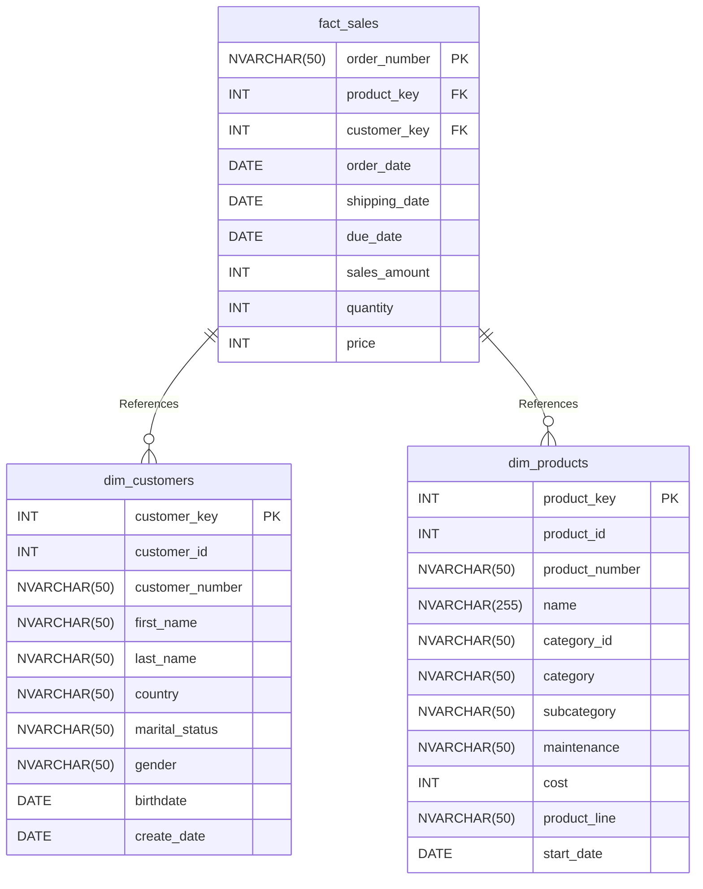

### Data Catalog: Sales Database

#### **1. fact_sales**  
Records transactional sales data including order details, customer/product references, and financial metrics.

| Column Name      | Data Type     | Description                                                                 |
|------------------|--------------|-----------------------------------------------------------------------------|
| order_number     | NVARCHAR(50) | Unique sales order identifier (e.g., `SO43766`)                             |
| product_key      | INT          | Foreign key to `dim_products` (e.g., `48` = HL Road Frame)                  |
| customer_key     | INT          | Foreign key to `dim_customers` (e.g., `5519` = Jon Yang)                    |
| order_date       | DATE         | Date order was placed (e.g., `2011-01-15`)                                  |
| shipping_date    | DATE         | Date product was shipped (e.g., `2011-01-22`)                               |
| due_date         | DATE         | Expected delivery date (e.g., `2011-01-27`)                                 |
| sales_amount     | INT          | Total revenue in AUD (quantity × price) (e.g., `3578`)                      |
| quantity         | INT          | Units purchased (e.g., `1`)                                                 |
| price            | INT          | Unit price in AUD (e.g., `3578`)                                            |

---

#### **2. dim_customers**  
Stores customer demographic and profile information.

| Column Name       | Data Type     | Description                                                                 |
|-------------------|--------------|-----------------------------------------------------------------------------|
| customer_key      | INT          | Unique customer identifier (e.g., `1`)                                      |
| customer_id       | INT          | Internal system ID (e.g., `11000`)                                          |
| customer_number   | NVARCHAR(50) | Public-facing ID (e.g., `AW00011000`)                                       |
| first_name        | NVARCHAR(50) | Customer's first name (e.g., `Jon`)                                         |
| last_name         | NVARCHAR(50) | Customer's last name (e.g., `Yang`)                                         |
| country           | NVARCHAR(50) | Country of residence (e.g., `Australia`)                                    |
| marital_status    | NVARCHAR(50) | `Single` or `Married` (e.g., `Married`)                                     |
| gender            | NVARCHAR(50) | `Male` or `Female` (e.g., `Male`)                                           |
| birthdate         | DATE         | Date of birth (e.g., `1971-10-06`)                                          |
| create_date       | DATE         | Record creation date (e.g., `2025-10-06`)                                   |

---

#### **3. dim_products**  
Contains product details including categorization, costs, and lifecycle.

| Column Name     | Data Type      | Description                                                                 |
|-----------------|---------------|-----------------------------------------------------------------------------|
| product_key     | INT           | Unique product identifier (e.g., `1`)                                       |
| product_id      | INT           | Internal system ID (e.g., `210`)                                            |
| product_number  | NVARCHAR(50)  | SKU/product code (e.g., `FR-R928-58`)                                       |
| name            | NVARCHAR(255) | Full product name (e.g., `HL Road Frame - Black - 58`)                      |
| category_id     | NVARCHAR(50)  | Abbreviated category (e.g., `CO_RF` = Components/Road Frames)               |
| category        | NVARCHAR(50)  | High-level category (e.g., `Components`)                                    |
| subcategory     | NVARCHAR(50)  | Detailed subcategory (e.g., `Road Frames`)                                  |
| maintenance     | NVARCHAR(50)  | Requires maintenance? (`Yes`/`No`) (e.g., `Yes`)                            |
| cost            | INT           | Manufacturing cost in AUD (e.g., `0`)                                       |
| product_line    | NVARCHAR(50)  | Business line (e.g., `Road`)                                                |
| start_date      | DATE          | Product launch date (e.g., `2003-07-01`)                                    |

---

### Entity-Relationship Diagram

### Key Relationships:
- `fact_sales.product_key` → `dim_products.product_key`  
- `fact_sales.customer_key` → `dim_customers.customer_key`